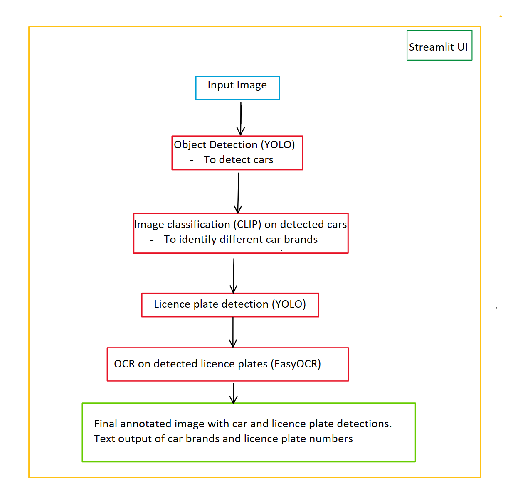

# Vehicle_Identification_System

# Overview:
This project delves into using Object Detection, Image Classification and OCR to build a vehicle identification system. 

The goal is to detect and track cars from an image using object detection. Then run image classification on the detected cars to identify their brands (Mercedes, Ferrari, Ford, etc). Next, we once again run object detection on the image to detect licence plates. Next, we run OCR on the detected licence plates to record the licence plte numbers of each car. Finally all of this is wrapped in a streamlit UI, which is used to accept an image as the input and displays the output image with annotations and data.

# Frameworks used:
YOLOv8: 
- Is an object detection framework, which can be trained on various datasets to detect and track specefic objects in an image/video. 
- Used to perform object detection to detect and localise cars, as well as licence plates, using custom trained weights

CLIP: 
- Is a Vision Transformer that finds similarities between image text pairs. 
- Used to perform image classification on the detected cards, to identify their brands.

EasyOCR: 
- Is an open-source tool used to perform OCR on images and extract text from them. 
- Used to extract licence plate numbers from the detected licence plate.

Streamlit:
- It is the web-dev UI interface used to accept the input image and display the output image (with annotations) and data.



# Getting Started:

Step 1:
- Clone this repository by running the below command in terminal:
```shell
git clone https://github.com/SumanthAppala/Vehicle_Identification_System.git
```
Step 2:
Run the below command to install the required python libraries:
```shell
pip install -r requirements.txt
```
Step 3:
In terminal run the below command:
```shell
streamlit run run_app.py
```
Step 4:
Once the UI pops up in browser, upload an image from 'data/sample_images' and it will process and display the out image and text

# Important files/locations:

- run_app.py: is the main file that need to be run for the UI to open, and accept inputs, as well as display the output.

- data/sample_images: contains the sameple images which to test this code on and analyse the output

- utils/inference.py: Contains the detections and classification logic as well as code for the Vehicle and Licence plate identification System

- utils/model_weights: contains the yolo object detection weights for the car detection and licence plate detection systems

# Note:
In the inference code, we use a 'SingletonMeta' type class. This ensures that only one instance of the class is created, no matter how many times it's called upon. This pattern can significantly reduce loading time as the initialization happens only once.


